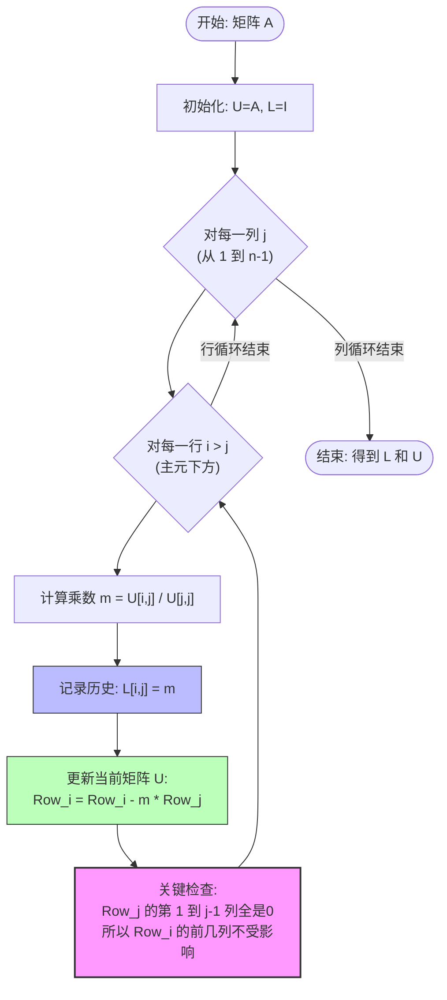

**标签：**: #LinearAlgebra #Matrix #Math #Obsidian

**Context**: 重新理解高斯消元、二次型配方与 LU 分解的深层联系。

---

## 1. 核心直觉：消元 = 配方

**结论：** 矩阵的**高斯消元（Gaussian Elimination）过程，本质上就是在对代数多项式进行配方法（Completing the Square）**。

### 1.1 对应关系图谱

对于二次型 $f(x,y) = x^T A x$，矩阵 $A$ 的 $LU$ 分解揭示了配方的结构：

$$A = \begin{bmatrix} 2 & 6 \\ 6 & 20 \end{bmatrix} \implies f(x,y) = 2x^2 + 12xy + 20y^2$$

经过消元（$A = LU$）：

$$\underbrace{\begin{bmatrix} 2 & 6 \\ 6 & 20 \end{bmatrix}}_{\text{原始方程}} = \underbrace{\begin{bmatrix} 1 & 0 \\ 3 & 1 \end{bmatrix}}_{\text{L: 比例/倍数}} \times \underbrace{\begin{bmatrix} 2 & 6 \\ 0 & 2 \end{bmatrix}}_{\text{U: 结果/系数}}$$

对应配方结果：

$$f(x,y) = \mathbf{2}(x+\mathbf{3}y)^2 + \mathbf{2}y^2$$

### 1.2 参数含义速查表

|**矩阵位置**|**数值示例**|**代数含义**|**物理/几何意义**|
|---|---|---|---|
|**U的主元 (Pivot)**|$2, 2$|配方项括号**外**的系数|决定抛物面的开口大小/方向|
|**L的元素 (Multiplier)**|$3$|配方项括号**内**的系数|变量之间的“捆绑”比例 ($x$是$y$的3倍)|
|**U的非对角元素**|$6$|原始混合项系数|保留的原始“纠缠”关系|
|**U的零元素**|$0$|变量解耦|标志着 $x$ 已从该项中彻底清除|

---

## 2. LU 分解的“防乱”指南

### 2.1 为什么叫 LU？

- **L (Lower Triangular):** **消元的历史记录**。
    
    - 记录了“为了消掉某个数，我们乘了多少倍”。
        
    - 对应“把土填回去”的操作（恢复原状）。
        
- **U (Upper Triangular):** **消元的最终结果**。
    
    - 剩下的主元和残差。
        

### 2.2 为什么第二轮消元不影响第一列？

这是手算时最容易迷糊的地方。

原理： 高斯消元是**迭代（Iterative）**过程，每一轮操作的对象是上一轮产生的“半成品矩阵”，而不是原始矩阵。

> [!TIP] 这里的逻辑链条
> 
> 1. **Round 1 结束：** 矩阵第一列非主元位置全部变成 **0**。
>     
> 2. **Round 2 开始：** 我们执行 $Row_3 - k \times Row_2$。
>     
> 3. **针对第一列的计算：** 实际上是 $0 - k \times 0 = 0$。
>     
> 4. **结论：** 因为操作源（Row 2）的第一列已经是0，所以它像“空枪”一样，不会改变 Row 3 第一列的状态。
>     

### 2.3 LU 分解流程图 (Mermaid)

---

## 3. 进阶：行列对称初等变换 (Congruence)

如果目标不仅是解方程，而是**彻底解耦**（化为标准型，即对角矩阵），就需要用到对称变换。

### 3.1 定义

合同变换 (Congruence Transformation):

$$P^T A P = \Lambda \quad (\Lambda \text{ 为对角矩阵})$$

### 3.2 操作法则

**“动行必动列”**：

1. 对 $A$ 做一次行变换：$R_i + k R_j$
    
2. **紧接着**对 $A$ 做一次完全相同的列变换：$C_i + k C_j$
    

> [!abstract] 原理：惯性定理 (Sylvester's Law of Inertia)
> 
> 这种变换如同物理上的坐标系旋转/拉伸。
> 
> 无论怎么变，最终对角矩阵 $\Lambda$ 中正数的个数和负数的个数永远不变（保持矩阵的“惯性”）。

### 3.3 两种方法的对比

|**方法**|**操作特点**|**结果形式**|**适用场景**|
|---|---|---|---|
|**高斯消元 (LU)**|**只做行变换**|上三角矩阵 $U$|1. 解线性方程组 $Ax=b$      2. **偷懒求标准型系数** (取对角线主元)|
|**对称变换**|**行变换 + 列变换**|对角矩阵 $\Lambda$|1. 求坐标变换矩阵 $P$      2. 理论分析二次型性质|

### 3.4 为什么求标准型系数只需做行变换？

因为**列变换**（$C_i + kC_j$）的主要作用是把非对角元素**清零**，它**绝对不会改变对角线上的主元数值**。

- 行变换负责**计算**（改变主元）。
    
- 列变换负责**打扫**（清零对称位）。
    

---

## 4. 3x3 矩阵手算示例 (复习用)

矩阵：

$$A = \begin{bmatrix} 1 & 2 & 1 \\ 2 & 8 & 10 \\ 1 & 10 & 25 \end{bmatrix}$$

### 过程记录

1. **消第一列 ($R_2-2R_1, R_3-1R_1$):**
    
    - 乘数 2 填入 $L_{21}$，乘数 1 填入 $L_{31}$。
        
    - $U$ 变成 $\begin{bmatrix} 1 & 2 & 1 \\ 0 & 4 & 8 \\ 0 & 8 & 24 \end{bmatrix}$。
        
2. **消第二列 ($R_3 - 2R_2$):**
    
    - 乘数 $8/4=2$ 填入 $L_{32}$。
        
    - $U$ 变成 $\begin{bmatrix} 1 & 2 & 1 \\ 0 & 4 & 8 \\ 0 & 0 & 8 \end{bmatrix}$。
        
    - _注意：此时 $R_2$ 第一列是0，所以 $R_3$ 第一列不受影响。_
        

### 最终结果

$$L = \begin{bmatrix} 1 & 0 & 0 \\ 2 & 1 & 0 \\ 1 & 2 & 1 \end{bmatrix}, \quad U = \begin{bmatrix} 1 & 2 & 1 \\ 0 & 4 & 8 \\ 0 & 0 & 8 \end{bmatrix}$$

**对应标准型：** $f = 1y_1^2 + 4y_2^2 + 8y_3^2$

## 5. 特例处理 (Special Cases)

标准的 $A=LU$ 分解并不总是可行的。当遇到**零主元 (Zero Pivot)** 或 **无平方项** 时，需要特殊手段。

### 5.1 矩阵视角的特例：$PA = LU$

当主元位置（对角线）为 0 时，无法进行除法消元。此时必须进行行交换 (Row Exchange)。

数学表达为：

$$P \cdot A = L \cdot U$$

其中 $P$ 是置换矩阵 (Permutation Matrix)。

> [!danger] 手算 PA=LU 的致命陷阱
> 
> 如果你在消元过程中交换了第 $i$ 行和第 $j$ 行：
> 
> 1. **U 要换：** 当前的剩余矩阵要交换行。
>     
> 2. **P 要换：** 记录这一步交换。
>     
> 3. **L 也要换！ (容易忘)：** **$L$ 矩阵中已经算出来的第 $i$ 行和第 $j$ 行（不含对角线）必须同步交换！**
>     

#### 实战演例 (3x3 零主元)

矩阵：

$$A = \begin{bmatrix} 0 & 1 & 1 \\ 1 & 2 & 1 \\ 2 & 7 & 9 \end{bmatrix}$$

**Step 1: 发现零主元，交换 R1 $\leftrightarrow$ R2**

- **P:** 记录交换。
    
- **U:** 第一行变为 $[1, 2, 1]$，第二行变为 $[0, 1, 1]$。
    
- **L:** 此时还没填数，不用动。
    

**Step 2: 消元第一列**

- 消 $R_3$ (值2)：$R_3 - 2R_1 \to$ 乘数 **2** 填入 $L_{31}$。
    
- $U$ 变为 $\begin{bmatrix} 1 & 2 & 1 \\ 0 & 1 & 1 \\ 0 & 3 & 7 \end{bmatrix}$。
    

**Step 3: 处理第二列 (假设我们想把 R3 换上来演示)**

- 我们决定交换 $R_2 \leftrightarrow R_3$。
    
- **U:** 变为 $\begin{bmatrix} 1 & 2 & 1 \\ 0 & 3 & 7 \\ 0 & 1 & 1 \end{bmatrix}$。
    
- **L (关键操作):** 刚才填入的 $L_{21}=0$ 和 $L_{31}=2$ **必须互换位置**！
    
    - $L$ 左下角由 $\begin{bmatrix} \dots \\ 0 \\ 2 \end{bmatrix}$ 变为 $\begin{bmatrix} \dots \\ \mathbf{2} \\ \mathbf{0} \end{bmatrix}$。
        

**Step 4: 继续消元**

- 主元 3，消下面的 1。乘数 $1/3$。
    
- 最终结果：
    
    $$L = \begin{bmatrix} 1 & 0 & 0 \\ 2 & 1 & 0 \\ 0 & 1/3 & 1 \end{bmatrix}, \quad U = \begin{bmatrix} 1 & 2 & 1 \\ 0 & 3 & 7 \\ 0 & 0 & -4/3 \end{bmatrix}$$
    

---

### 5.2 代数视角的特例：无平方项配方

当二次型 $f(x)$ 中完全没有 $x_1^2, x_2^2$ 等平方项，只有混合项 $x_i x_j$ 时（对应矩阵对角线全为0）。

核心技巧：造平方 (Create Squares)

利用公式：$x_1 x_2 = \frac{1}{4}[(x_1+x_2)^2 - (x_1-x_2)^2]$

或者令：

$$\begin{cases} x_1 = y_1 + y_2 \\ x_2 = y_1 - y_2 \end{cases}$$

#### 实战演例

$$f = 2x_1x_2 + 2x_1x_3 - 6x_2x_3$$

(对应矩阵对角线全是0，无法直接配方)

1. **代换：** 令 $x_1 = y_1+y_2, \quad x_2 = y_1-y_2, \quad x_3 = y_3$。
    
2. 代入整理：
    
    原式变为 $2(y_1^2 - y_2^2) + 2(y_1+y_2)y_3 - 6(y_1-y_2)y_3$
    
    $= 2y_1^2 - 2y_2^2 - 4y_1y_3 + 8y_2y_3$
    
3. **常规配方：** 此时有了 $y_1^2$ 和 $y_2^2$，可以按常规步骤进行（先配含 $y_1$ 的，再配含 $y_2$ 的）。
    

> [!info] 几何意义
> 
> 这种代换相当于把坐标轴旋转了 45 度。比如双曲线 $xy=1$ (无平方项)，旋转后变成 $u^2 - v^2 = C$ (标准型)。